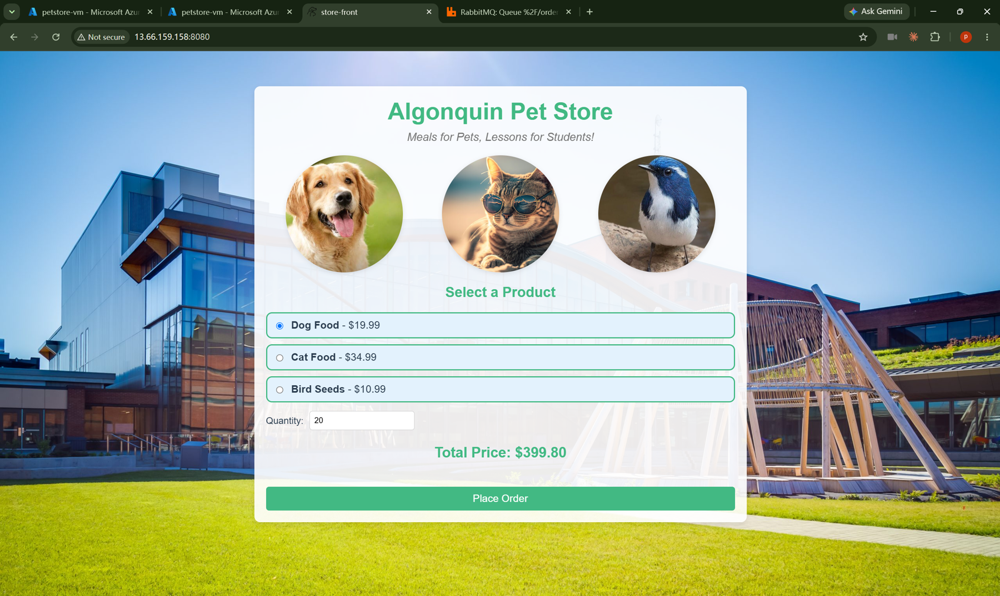

# CST8915 Lab 1: Algonquin Pet Store on Azure VM

| Student Name | Student ID | Course | Semester |
|---|---|---|---|
| Peng Wang | 041107730 | CST8915 Full-stack Cloud-native Development | Fall 2026 |

---

## Demo Video

🎥 [Watch Demo Video](https://www.youtube.com/watch?v=qnSOvplnRw8)

---

## Technical Explanations

### Order Service (Node.js)

The Order Service accepts customer orders and hands them to RabbitMQ. It is a small Express application (`index.js`) with a single route, `POST /orders`, listening on port 3000. Node.js with Express fits this job because the service does almost no computation: it parses a JSON body and waits on network I/O, which is exactly what Node's event loop handles well, and the `amqplib` package gives it a ready-made AMQP 0-9-1 client. The `cors` middleware is enabled for every route because the browser loads the page from port 8080 and then calls port 3000, which the browser treats as a different origin.

In the architecture it is the **producer**. For each request it opens a connection to `amqp://localhost`, creates a *confirm channel*, asserts the durable queue `order_queue`, and publishes the order as a persistent, mandatory message. It replies `Order received` only after RabbitMQ confirms the message, and returns HTTP 500 if the connection, channel, or routing fails; the `finish()` helper makes sure exactly one response is sent and the connection is closed. The service never talks to the Product Service and does not know who will consume the order, so order intake keeps working even though this lab has no consumer: messages simply stay in the queue. One gap against the Twelve-Factor "Config" factor is that the RabbitMQ URL and the port are constants in the code instead of environment variables.

### Product Service (Rust)

The Product Service owns the product catalog. It is a Rust program (`src/main.rs`) built on the Warp web framework and the Tokio async runtime, with `serde_json` producing the JSON. It exposes one read-only endpoint, `GET /products`, on `0.0.0.0:3030`, and returns three hard-coded products: Dog Food $19.99, Cat Food $34.99, and Bird Seeds $10.99. Rust compiles to a single native binary with no garbage collector, so a catalog endpoint that every page load hits stays fast and memory-safe with a very small footprint. The trade-off is visible in the lab: the first `cargo run` has to compile all dependencies, which took about half a minute on my 2-vCPU B2ls_v2 VM before the service could start.

In the architecture it is an independent, stateless service: it has no database, does not use RabbitMQ, and never calls another service, which is why it can be installed and started before or after the Order Service. Its only client is the Store Front, which calls it over HTTP/REST from the browser. Because that call is cross-origin, the route is wrapped in a Warp CORS filter that allows any origin but only the `GET` method. Binding to `0.0.0.0` rather than `127.0.0.1` is what lets the request from my laptop reach it through the VM's public IP once the NSG rule for port 3030 exists.

### Store Front (Vue.js)

The Store Front is the customer-facing single-page application, built with Vue 3 and served in this lab by the Vue CLI development server on port 8080. All the logic is in `src/components/OrderForm.vue`: the `created()` hook fetches the catalog, radio buttons bind the chosen product through `v-model`, a computed property `totalPrice` multiplies price by quantity (two Dog Food gives $39.98), and the **Place Order** button stays disabled until a product and a positive quantity are selected. Vue suits this because its reactive data binding updates the total and the button state without any manual DOM code.

In the architecture it is the only part the user sees, and it holds no business data of its own. It talks to both back ends with the browser's Fetch API: `GET http://<VM-IP>:3030/products` to the Product Service, and `POST http://<VM-IP>:3000/orders` with a JSON body of `product`, `quantity`, and `totalPrice` to the Order Service. The key detail is that these requests are sent by the browser on my laptop, not by the VM, so `localhost` in the original code had to be replaced with the VM's public IP, and ports 3000 and 3030 had to be opened in the NSG alongside 8080. It never touches RabbitMQ directly; it only learns that the order was queued from the Order Service's HTTP response.

---

## Challenges and Learnings (Optional)

**Deployment used**: `petstore-vm`, Standard_B2ls_v2 (2 vCPU / 4 GiB), Ubuntu Server 24.04 LTS, region West US 2, resource group `lab1-petstore-rg`.

- **VM size "not available" in every region.** The default size (D2s_v3) failed with `NotAvailableForSubscription`, and the whole B-series was greyed out in Canada Central, East US and Central US. Two separate things were going on. First, my Azure for Students subscription has an *Allowed resource deployment regions* policy (`southcentralus`, `eastus`, `canadacentral`, `westus`, `westus2`), so Central US would have been rejected at validation even though the size looked selectable there. Second, the create form defaults **Availability options** to *Availability zone / Zone 1* and silently resets it every time the region changes; in West US 2 the error was actually "No zones are supported". After switching to *No infrastructure redundancy required*, the B-Series v2 sizes appeared and I used B2ls_v2, one of the sizes named in the course announcement. Lesson: read the exact error text, because "size unavailable" can mean subscription, policy, or zone.
- **`localhost` means the browser's machine, not the server.** The Store Front's `fetch()` calls run in the browser on my laptop, so `http://localhost:3030` pointed at my laptop. That confused me at first because all three services run on the same VM; the point is that the dev server on the VM only *delivers* the JavaScript, and the browser executes it. Replacing both URLs in `OrderForm.vue` with the VM's public IP, with ports 3000 and 3030 open in the NSG in addition to 8080, made the requests reach the VM. The Order Service keeps `amqp://localhost` because it really is on the same machine as RabbitMQ. This is also a Twelve-Factor "Config" violation: the address is hard-coded in source, so every new IP needs a code edit.
- **Foreground processes look like a hang.** After `cargo run` printed `Running target/debug/product-service`, nothing else appeared and the prompt never came back, so I first thought it was stuck. It is simply a long-running process that logs nothing; `curl http://localhost:3030/products` from a second terminal proved it was serving. I kept each service in its own VS Code terminal, which also let me watch the Order Service print `Sent order to queue: ...` when I placed an order.
- **Verifying the queue.** With no consumer in this lab, orders stay in `order_queue`. `sudo rabbitmqctl list_queues name durable messages` showed `durable=true` and the count increasing with each order, and the messages were still there after restarting RabbitMQ, which confirms the durable queue plus persistent messages behave as the Order Service code intends.

---

## Screenshots

Store Front served from the Azure VM at `http://13.66.159.158:8080`:

---

## Acknowledgments

- Lab instructions and source code: `ramymohamed10/26F_Lab1_CST8915`.
- GenAI declaration: As permitted for labs in this course, I used Claude (Anthropic) to help me understand the source code, troubleshoot Azure errors, and review the wording of this README; the deployment, testing, and demo video are my own work.
